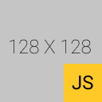

# README of DummyImage.js



---

## Installation

### Download [DummyImage.js](DummyImage.js)

## Importation

### Add `<script>` tag in html file (no `defer` needed)

```html
<script src="DummyImage.js"></script>
```

## Usage

### Add `src="#dummy"` to img tag and add size

```html

```

## License

### [MIT LICENSE](LICENSE.txt)

## Badges

[](https://forthebadge.com)

[](https://forthebadge.com)
